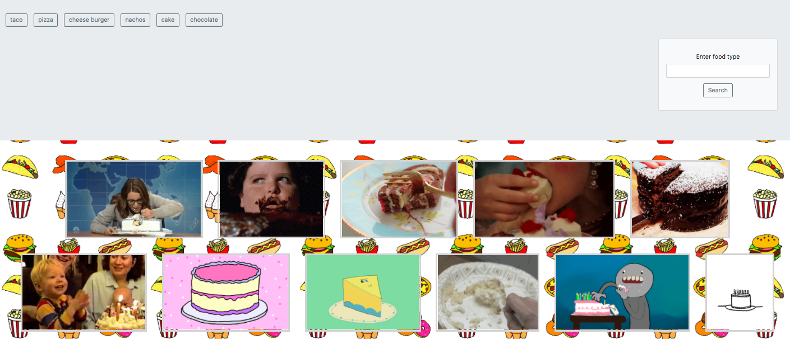

# **GifTastic!** 

This project is based on food type gifs. A user can use the search button to look for a specific type of food. Once user clicks the search button the food type is populated into a button and added to existing array of food type buttons. A user can click on any of the buttons and can see gifs that are related to the button clicked. This web app is purely for fun and hopefully can make you laugh. 

:hamburger: :spaghetti: :sushi: :fries: :icecream: :cake: :fried_shrimp: :pizza:
Want to try it out? ------> [GifTastic](https://stacy89.github.io/GifTastic/) 

